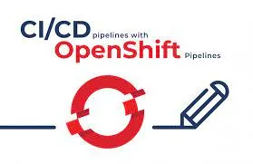
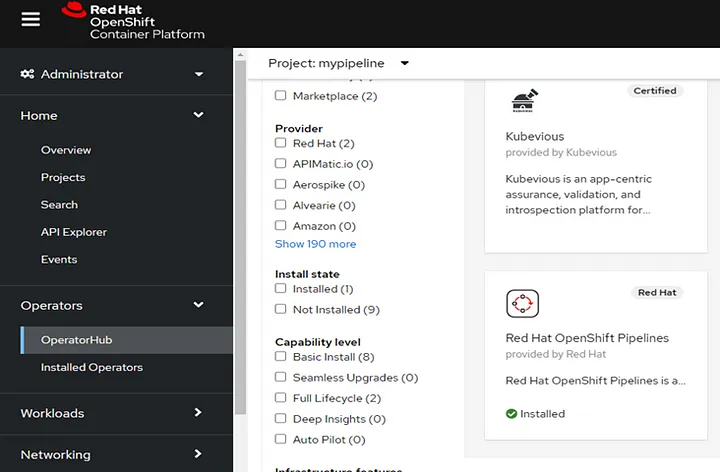
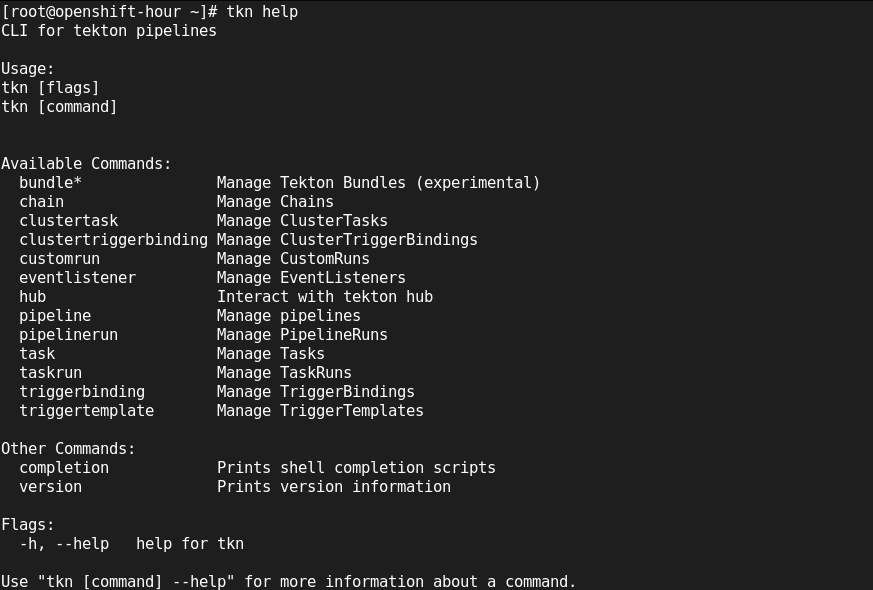
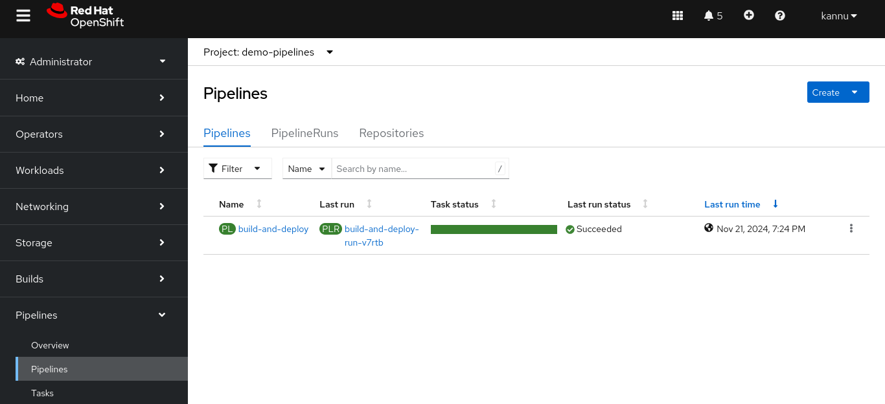
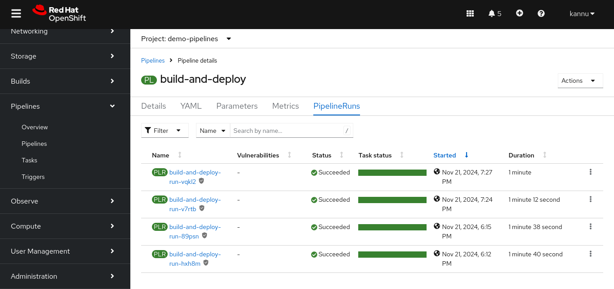
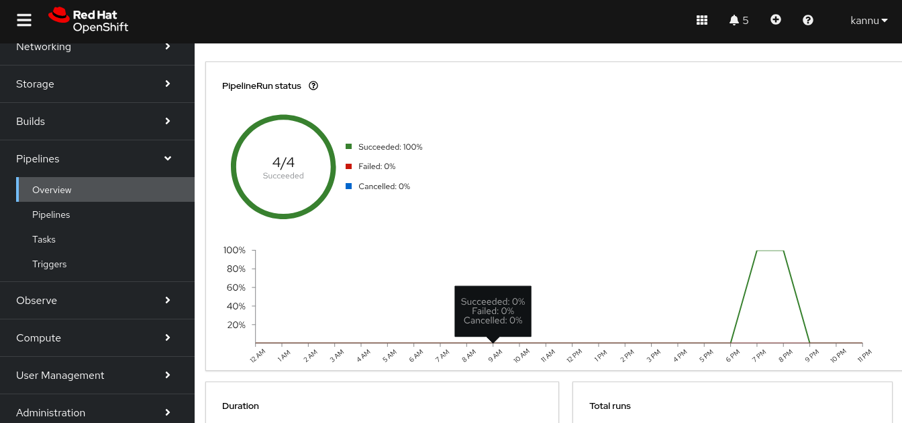
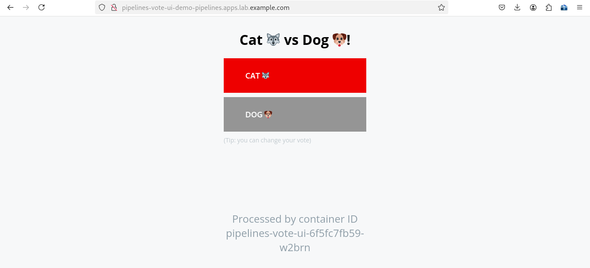

    [root@openshift-hour pipeline]# oc new-project oco 

    [root@openshift-hour pipeline]# oc get serviceaccount pipeline
    NAME       SECRETS   AGE
    pipeline   1         175

    [root@openshift-hour pipeline]# oc adm policy add-scc-to-user privileged -z pipeline

    [root@openshift-hour pipeline]# oc create -f https://raw.githubusercontent.com/openshift/pipelines-tutorial/master/01_pipeline/01_apply_manifest_task.yaml

    [root@openshift-hour pipeline]# oc create -f https://raw.githubusercontent.com/openshift/pipelines-tutorial/master/01_pipeline/02_update_deployment_task.yaml

    [root@openshift-hour pipeline]# tkn task ls
    [root@openshift-hour ~]# tkn task ls
    NAME                DESCRIPTION   AGE
    apply-manifests                   1 hour ago
    maven-build                       1 hour ago
    update-deployment                 1 hour ago

    [root@openshift-hour pipeline]# tkn clustertasks ls
    Command "list" is deprecated, ClusterTasks are deprecated, this command will be removed in future releases.
    NAME                        DESCRIPTION              AGE
    argocd-task-sync-and-wait   This task syncs (de...   3 hours ago
    buildah                     Buildah task builds...   3 hours ago
    buildah-1-16-0              Buildah task builds...   3 hours ago
    git-cli                     This task can be us...   3 hours ago
    git-clone                   These Tasks are Git...   3 hours ago
    git-clone-1-16-0            These Tasks are Git...   3 hours ago
    helm-upgrade-from-repo      These tasks will in...   3 hours ago
    helm-upgrade-from-source    These tasks will in...   3 hours ago
    jib-maven                   This Task builds Ja...   3 hours ago
    kn                          This Task performs ...   3 hours ago
    kn-1-16-0                   This Task performs ...   3 hours ago
    kn-apply                    This task deploys a...   3 hours ago
    kn-apply-1-16-0             This task deploys a...   3 hours ago
    kubeconfig-creator          This Task do a simi...   3 hours ago
    maven                       This Task can be us...   3 hours ago
    maven-1-16-0                This Task can be us...   3 hours ago
    openshift-client            This task runs comm...   3 hours ago
    openshift-client-1-16-0     This task runs comm...   3 hours ago
    pull-request                This Task allows a ...   3 hours ago
    s2i-dotnet                  s2i-dotnet task fet...   3 hours ago
    s2i-dotnet-1-16-0           s2i-dotnet task fet...   3 hours ago
    s2i-go                      s2i-go task clones ...   3 hours ago
    s2i-go-1-16-0               s2i-go task clones ...   3 hours ago
    s2i-java                    s2i-java task clone...   3 hours ago
    s2i-java-1-16-0             s2i-java task clone...   3 hours ago
    s2i-nodejs                  s2i-nodejs task clo...   3 hours ago
    s2i-nodejs-1-16-0           s2i-nodejs task clo...   3 hours ago
    s2i-perl                    s2i-perl task clone...   3 hours ago
    s2i-perl-1-16-0             s2i-perl task clone...   3 hours ago
    s2i-php                     s2i-php task clones...   3 hours ago
    s2i-php-1-16-0              s2i-php task clones...   3 hours ago
    s2i-python                  s2i-python task clo...   3 hours ago
    s2i-python-1-16-0           s2i-python task clo...   3 hours ago
    s2i-ruby                    s2i-ruby task clone...   3 hours ago
    s2i-ruby-1-16-0             s2i-ruby task clone...   3 hours ago
    skopeo-copy                 Skopeo is a command...   3 hours ago
    skopeo-copy-1-16-0          Skopeo is a command...   3 hours ago
    tkn                         This task performs ...   3 hours ago
    tkn-1-16-0                  This task performs ...   3 hours ago
    trigger-jenkins-job         The following task ...   3 hours ago
    

    [root@openshift-hour pipeline]# oc create -f https://raw.githubusercontent.com/openshift/pipelines-tutorial/master/01_pipeline/04_pipeline.yaml

    [root@openshift-hour pipeline]# tkn pipeline ls

    [root@openshift-hour pipeline]# oc project
    Using project "oco" on server "https://api.lab.example.com:6443".
    

    [root@openshift-hour pipeline]# tkn pipeline start build-and-deploy     --prefix-name build-deploy-api-pipelinerun     -w name=shared-workspace,volumeClaimTemplateFile=https://raw.githubusercontent.com/openshift/pipelines-tutorial/master/01_pipeline/03_persistent_volume_claim.yaml     -p deployment-name=pipelines-vote-api     -p git-url=https://github.com/openshift/pipelines-vote-api.git     -p IMAGE=image-registry.openshift-image-registry.svc:5000/oco/pipelines-vote-api     --use-param-defaults

    
    [root@openshift-hour pipeline]# oc get is
    NAME                        IMAGE REPOSITORY                                                                            TAGS        UPDATED
    pipelines-operator-bundle   default-route-openshift-image-registry.apps.lab.example.com/oco/pipelines-operator-bundle   v1.16.1-3   2 hours ago
    pipelines-vote-api          default-route-openshift-image-registry.apps.lab.example.com/oco/pipelines-vote-api          latest      About an hour ago
    
    [root@openshift-hour pipeline]# tkn pipelinerun list
    NAME                                 STARTED      DURATION   STATUS
    build-deploy-api-pipelinerun-kl7k6   1 hour ago   7m11s      Succeeded
    

# 02. Tekton Play 02

As working on Openshift from the platform side I always had curiosity of how the app team goes through application deployment, CICD process and finally deploy the application on OpenShift Platform and how the changes are been made to the application and how they integrate those changes live into the application within minutes.

First lets understand what is Tekton in short:-

Tekton is an open source project that provides a framework to create cloud-native CI/CD pipelines quickly. Tekton introduces a number of standard custom resource definitions (CRDs) for defining CI/CD pipelines that are portable across Kubernetes distributions.

- A front-end interface, pipelines-vote-ui, with the source code in the pipelines-vote-ui Git repository.

- A back-end interface, pipelines-vote-api, with the source code in the pipelines-vote-api Git repository.

- The apply-manifests and update-deployment tasks in the pipelines-tutorial Git repository.

Steps to create your first OpenShift Pipeline using Tekton:-

## Installing the Red Hat OpenShift Pipelines Operator

You can install Red Hat OpenShift Pipelines using the Operator listed in the OpenShift Container Platform OperatorHub. When you install the Red Hat OpenShift Pipelines Operator, the custom resources (CRs) required for the pipelines configuration are automatically installed along withthe Operator.

2. Create a project where you will create the pipeline tasks and other resources.
            
        [root@openshift-hour ~]# oc create -f https://raw.githubusercontent.com/openshift/pipelines-tutorial/pipelines-1.7/01_pipeline/01_apply_manifest_task.yaml
            
        [root@openshift-hour ~]# oc create -f https://raw.githubusercontent.com/openshift/pipelines-tutorial/pipelines-1.7/01_pipeline/02_update_deployment_task.yaml
            
3. You can run tkn help to list out all the tekton commands

4. Creating a Pipeline

In this section, you will create a pipeline that takes the source code of the application from GitHub, and then builds and deploys it on OpenShift Container Platform. The Pipeline will perform following tasks.

-    Clones the source code of the application from the Git repository by referring to the git-url and git-revision parameters.

-    Builds the container image using the buildah cluster task.

-    Pushes the image to the internal image registry by referring to the image parameter.

-    Deploys the new image on OpenShift Container Platform by using the apply-manifests and update-deployment tasks.

    [root@openshift-hour ~]# oc create -f https://raw.githubusercontent.com/openshift/pipelines-tutorial/pipelines-1.7/01_pipeline/04_pipeline.yaml

5. Running the Pipeline:-

Start the pipeline for the back-end application:

    [root@openshift-hour ~]# tkn pipeline start build-and-deploy \
        -w name=shared-workspace,volumeClaimTemplateFile=https://raw.githubusercontent.com/openshift/pipelines-tutorial/pipelines-1.7/01_pipeline/03_persistent_volume_claim.yaml \
        -p deployment-name=pipelines-vote-api \
        -p git-url=https://github.com/openshift/pipelines-vote-api.git \
        -p IMAGE='image-registry.openshift-image-registry.svc:5000/$(context.pipelineRun.namespace)/pipelines-vote-api' \--use-param-defaults

To track the progress of the pipeline run, enter the following command:

    [root@openshift-hour ~]# tkn pipelinerun logs build-and-deploy-run-v7rtb -f -n demo-pipelines
    [fetch-repository : clone] + '[' false = true ']'
    [fetch-repository : clone] + '[' false = true ']'
    [fetch-repository : clone] + '[' false = true ']'
    [fetch-repository : clone] + CHECKOUT_DIR=/workspace/output/
    [build-image : build-and-push] [1/2] STEP 1/5: FROM image-registry.openshift-image-registry.svc:5000/openshift/golang:latest AS builder
    [fetch-repository : clone] + '[' true = true ']'
    [build-image : build-and-push] Trying to pull image-registry.openshift-image-registry.svc:5000/openshift/golang:latest...
    [fetch-repository : clone] + cleandir
    [build-image : build-and-push] Getting image source signatures
    [fetch-repository : clone] + '[' -d /workspace/output/ ']'
    [build-image : build-and-push] Copying blob sha256:87b6121ef647e82c2efa8e6489d94c7668d88af38c138236592c6675acdf055a
    [fetch-repository : clone] + rm -rf '/workspace/output//*'
    [build-image : build-and-push] Copying blob sha256:6208c5a2e205726f3a2cd42a392c5e4f05256850d13197a711000c4021ede87b
    [fetch-repository : clone] + rm -rf '/workspace/output//.[!.]*'
    [build-image : build-and-push] Copying blob sha256:f6efb7833548fe17294f057c70215a3789c7ac86e39f698f00c4e7a895ccadf3
    [fetch-repository : clone] + rm -rf '/workspace/output//..?*'
    [build-image : build-and-push] Copying blob sha256:4186a94a1e5b175d7bc3dd68bc28daf97c822f6e56c9d8aee432af1508f245e7
    [fetch-repository : clone] + test -z ''
    [build-image : build-and-push] Copying config sha256:7deee1f302eac4ab5424e1c47cf2c33f8ae965cd09f9d9f476576eaba2171202
    [fetch-repository : clone] + test -z ''
    [build-image : build-and-push] Writing manifest to image destination
    [fetch-repository : clone] + test -z ''
    [build-image : build-and-push] [1/2] STEP 2/5: WORKDIR /build
    [fetch-repository : clone] + git config --global --add safe.directory /workspace/output
    [build-image : build-and-push] [1/2] STEP 3/5: ADD . /build/
    [fetch-repository : clone] + /ko-app/git-init -url=https://github.com/openshift/pipelines-vote-api.git -revision=pipelines-1.7 -refspec= -path=/workspace/output/ -sslVerify=true -submodules=true -depth=1 -sparseCheckoutDirectories=
    [build-image : build-and-push] [1/2] STEP 4/5: RUN mkdir /tmp/cache
    [build-image : build-and-push] [1/2] STEP 5/5: RUN CGO_ENABLED=0 GOCACHE=/tmp/cache go build  -mod=vendor -v -o /tmp/api-server .
    [fetch-repository : clone] {"level":"error","ts":1732197282.7292387,"caller":"git/git.go:53","msg":"Error running git [remote get-url origin]: exit status 2\nerror: No such remote 'origin'\n","stacktrace":"github.com/tektoncd-catalog/git-clone/git-init/git.run\n\t/go/src/github.com/tektoncd-catalog/git-clone/image/git-init/git/git.go:53\ngithub.com/tektoncd-catalog/git-clone/git-init/git.Fetch\n\t/go/src/github.com/tektoncd-catalog/git-clone/image/git-init/git/git.go:109\nmain.main\n\t/go/src/github.com/tektoncd-catalog/git-clone/image/git-init/main.go:52\nruntime.main\n\t/usr/lib/golang/src/runtime/proc.go:271"}
    [build-image : build-and-push] gopkg.in/yaml.v2
    [fetch-repository : clone] {"level":"info","ts":1732197286.4150355,"caller":"git/git.go:186","msg":"Successfully cloned https://github.com/openshift/pipelines-vote-api.git @ 6bab49647be14def608e007e2f72fc83157a762b (grafted, HEAD, origin/pipelines-1.7) in path /workspace/output/"}
    [build-image : build-and-push] github.com/gin-gonic/gin/internal/json
    [build-image : build-and-push] crypto/internal/boring
    [fetch-repository : clone] {"level":"info","ts":1732197286.4733891,"caller":"git/git.go:225","msg":"Successfully initialized and updated submodules in path /workspace/output/"}
    [fetch-repository : clone] + cd /workspace/output/
    [build-image : build-and-push] github.com/golang/protobuf/proto
    [fetch-repository : clone] ++ git rev-parse HEAD
    [build-image : build-and-push] net
    [fetch-repository : clone] + RESULT_SHA=6bab49647be14def608e007e2f72fc83157a762b
    [fetch-repository : clone] + EXIT_CODE=0
    [build-image : build-and-push] crypto/hmac
    [build-image : build-and-push] crypto/sha512
    [fetch-repository : clone] + '[' 0 '!=' 0 ']'
    [build-image : build-and-push] crypto/sha256
    [fetch-repository : clone] ++ git log -1 --pretty=%ct
    [build-image : build-and-push] crypto/sha1
    [fetch-repository : clone] + RESULT_COMMITTER_DATE=1645700163
    [build-image : build-and-push] crypto/aes
    [fetch-repository : clone] + printf %s 1645700163
    [build-image : build-and-push] vendor/golang.org/x/crypto/hkdf
    [fetch-repository : clone] + printf %s 6bab49647be14def608e007e2f72fc83157a762b
    [build-image : build-and-push] crypto/rand
    [fetch-repository : clone] + printf %s https://github.com/openshift/pipelines-vote-api.git
    [build-image : build-and-push] crypto/ed25519
    
    [build-image : build-and-push] crypto/rsa
    [build-image : build-and-push] crypto/elliptic
    [build-image : build-and-push] crypto/ecdsa
    [build-image : build-and-push] gopkg.in/go-playground/validator.v8
    [build-image : build-and-push] vendor/golang.org/x/net/http/httpproxy
    [build-image : build-and-push] golang.org/x/sys/unix
    [build-image : build-and-push] net/textproto
    [build-image : build-and-push] crypto/x509
    [build-image : build-and-push] vendor/golang.org/x/net/http/httpguts
    [build-image : build-and-push] mime/multipart
    [build-image : build-and-push] github.com/mattn/go-isatty
    [build-image : build-and-push] crypto/tls
    [build-image : build-and-push] net/http/httptrace
    [build-image : build-and-push] net/http
    [build-image : build-and-push] github.com/gin-contrib/sse
    [build-image : build-and-push] net/rpc
    [build-image : build-and-push] net/http/httputil
    [build-image : build-and-push] github.com/ugorji/go/codec
    [build-image : build-and-push] github.com/gin-gonic/gin/binding
    [build-image : build-and-push] github.com/gin-gonic/gin/render
    [build-image : build-and-push] github.com/gin-gonic/gin
    [build-image : build-and-push] github.com/openshift/pipelines-vote-api
    [build-image : build-and-push] [2/2] STEP 1/4: FROM scratch
    [build-image : build-and-push] [2/2] STEP 2/4: WORKDIR /app
    [build-image : build-and-push] [2/2] STEP 3/4: COPY --from=builder /tmp/api-server /app/api-server
    [build-image : build-and-push] [2/2] STEP 4/4: CMD [ "/app/api-server" ]
    [build-image : build-and-push] [2/2] COMMIT image-registry.openshift-image-registry.svc:5000/demo-pipelines/pipelines-vote-api
    [build-image : build-and-push] Getting image source signatures
    [build-image : build-and-push] Copying blob sha256:71933305b944c2ed12aeb5501c7f1bc89b37d7633a46f9957f06e84f267e256f
    [build-image : build-and-push] Copying config sha256:0d285bacb0f7351290267d74d227ba051cb3b038413d231e22c0ec188b18b383
    [build-image : build-and-push] Writing manifest to image destination
    [build-image : build-and-push] --> 0d285bacb0f7
    [build-image : build-and-push] Successfully tagged image-registry.openshift-image-registry.svc:5000/demo-pipelines/pipelines-vote-api:latest
    [build-image : build-and-push] 0d285bacb0f7351290267d74d227ba051cb3b038413d231e22c0ec188b18b383
    [build-image : build-and-push] Getting image source signatures
    [build-image : build-and-push] Copying blob sha256:71933305b944c2ed12aeb5501c7f1bc89b37d7633a46f9957f06e84f267e256f
    [build-image : build-and-push] Copying config sha256:0d285bacb0f7351290267d74d227ba051cb3b038413d231e22c0ec188b18b383
    [build-image : build-and-push] Writing manifest to image destination
    [build-image : build-and-push] sha256:9421d891a935f7eed9f02534f4e08dd90bc456e3db908e4c5d947b54f0a0a751image-registry.openshift-image-registry.svc:5000/demo-pipelines/pipelines-vote-api
    
    [apply-manifests : apply] Applying manifests in k8s directory
    [apply-manifests : apply] deployment.apps/pipelines-vote-api configured
    [apply-manifests : apply] service/pipelines-vote-api unchanged
    [apply-manifests : apply] -----------------------------------
    
    [update-deployment : patch] deployment.apps/pipelines-vote-api patched
    
    
Here is a small snippet of my pipeline been successfully deployed

Starting Pipeline for the front-end application.

    [root@openshift-hour ~]# tkn pipeline start build-and-deploy \
        -w name=shared-workspace,volumeClaimTemplateFile=https://raw.githubusercontent.com/openshift/pipelines-tutorial/pipelines-1.7/01_pipeline/03_persistent_volume_claim.yaml \
        -p deployment-name=pipelines-vote-ui \
        -p git-url=https://github.com/openshift/pipelines-vote-ui.git \
        -p IMAGE='image-registry.openshift-image-registry.svc:5000/$(context.pipelineRun.namespace)/pipelines-vote-ui' \
        --use-param-defaults
    PipelineRun started: build-and-deploy-run-vqkl2
    
    In order to track the PipelineRun progress run:
    tkn pipelinerun logs build-and-deploy-run-vqkl2 -f -n demo-pipelines

    [root@openshift-hour ~]#  tkn pipelinerun logs build-and-deploy-run-vqkl2 -f -n demo-pipelines
    [fetch-repository : clone] + '[' false = true ']'
    [fetch-repository : clone] + '[' false = true ']'
    [fetch-repository : clone] + '[' false = true ']'
    [fetch-repository : clone] + CHECKOUT_DIR=/workspace/output/
    [fetch-repository : clone] + '[' true = true ']'
    [fetch-repository : clone] + cleandir
    [fetch-repository : clone] + '[' -d /workspace/output/ ']'
    [fetch-repository : clone] + rm -rf '/workspace/output//*'
    [fetch-repository : clone] + rm -rf '/workspace/output//.[!.]*'
    [fetch-repository : clone] + rm -rf '/workspace/output//..?*'
    [fetch-repository : clone] + test -z ''
    [fetch-repository : clone] + test -z ''
    [fetch-repository : clone] + test -z ''
    [fetch-repository : clone] + git config --global --add safe.directory /workspace/output
    [fetch-repository : clone] + /ko-app/git-init -url=https://github.com/openshift/pipelines-vote-ui.git -revision=pipelines-1.7 -refspec= -path=/workspace/output/ -sslVerify=true -submodules=true -depth=1 -sparseCheckoutDirectories=
    [fetch-repository : clone] {"level":"error","ts":1732197471.7156472,"caller":"git/git.go:53","msg":"Error running git [remote get-url origin]: exit status 2\nerror: No such remote 'origin'\n","stacktrace":"github.com/tektoncd-catalog/git-clone/git-init/git.run\n\t/go/src/github.com/tektoncd-catalog/git-clone/image/git-init/git/git.go:53\ngithub.com/tektoncd-catalog/git-clone/git-init/git.Fetch\n\t/go/src/github.com/tektoncd-catalog/git-clone/image/git-init/git/git.go:109\nmain.main\n\t/go/src/github.com/tektoncd-catalog/git-clone/image/git-init/main.go:52\nruntime.main\n\t/usr/lib/golang/src/runtime/proc.go:271"}
    [fetch-repository : clone] {"level":"info","ts":1732197473.0214505,"caller":"git/git.go:186","msg":"Successfully cloned https://github.com/openshift/pipelines-vote-ui.git @ 64c7c215433f841ce2e91e08bc4cfde014f3810d (grafted, HEAD, origin/pipelines-1.7) in path /workspace/output/"}
    [fetch-repository : clone] {"level":"info","ts":1732197473.0573432,"caller":"git/git.go:225","msg":"Successfully initialized and updated submodules in path /workspace/output/"}
    [fetch-repository : clone] + cd /workspace/output/
    [fetch-repository : clone] ++ git rev-parse HEAD
    [fetch-repository : clone] + RESULT_SHA=64c7c215433f841ce2e91e08bc4cfde014f3810d
    [fetch-repository : clone] + EXIT_CODE=0
    [fetch-repository : clone] + '[' 0 '!=' 0 ']'
    [fetch-repository : clone] ++ git log -1 --pretty=%ct
    [fetch-repository : clone] + RESULT_COMMITTER_DATE=1645700163
    [fetch-repository : clone] + printf %s 1645700163
    [fetch-repository : clone] + printf %s 64c7c215433f841ce2e91e08bc4cfde014f3810d
    [fetch-repository : clone] + printf %s https://github.com/openshift/pipelines-vote-ui.git
    
    [build-image : build-and-push] STEP 1/6: FROM image-registry.openshift-image-registry.svc:5000/openshift/python:latest
    [build-image : build-and-push] Trying to pull image-registry.openshift-image-registry.svc:5000/openshift/python:latest...
    [build-image : build-and-push] Getting image source signatures
    [build-image : build-and-push] Copying blob sha256:f5abea0fd7bd387780eeb9e0cb71e01db5ea6501fbf6917dea9230038e4c30ff
    [build-image : build-and-push] Copying blob sha256:de1a4526c3d6cdf0e04f24b1888f5ef31425209f1c26e5a6ae7694cdad6e8688
    [build-image : build-and-push] Copying blob sha256:d921314675de9e6f8033d15e6891370f1d572fa0b4336c3ae01e10adc764f0c6
    [build-image : build-and-push] Copying blob sha256:dbefd0ecfdfe5580bdbd8585e5d84d4fe35ae61e5db7fd31a759c9d0ea9ef90f
    [build-image : build-and-push] Copying config sha256:2560c6aee8f1eae951064ffb538d0692908624f6a7666f1a2a9c6638c040dba0
    [build-image : build-and-push] Writing manifest to image destination
    [build-image : build-and-push] STEP 2/6: ADD requirements.txt /opt/app-root/src/requirements.txt
    [build-image : build-and-push] STEP 3/6: RUN pip install -r requirements.txt
    [build-image : build-and-push] Collecting Flask (from -r requirements.txt (line 1))
    [build-image : build-and-push]   Obtaining dependency information for Flask from https://files.pythonhosted.org/packages/af/47/93213ee66ef8fae3b93b3e29206f6b251e65c97bd91d8e1c5596ef15af0a/flask-3.1.0-py3-none-any.whl.metadata
    [build-image : build-and-push]   Downloading flask-3.1.0-py3-none-any.whl.metadata (2.7 kB)
    [build-image : build-and-push] Collecting gunicorn (from -r requirements.txt (line 2))
    [build-image : build-and-push]   Obtaining dependency information for gunicorn from https://files.pythonhosted.org/packages/cb/7d/6dac2a6e1eba33ee43f318edbed4ff29151a49b5d37f080aad1e6469bca4/gunicorn-23.0.0-py3-none-any.whl.metadata
    [build-image : build-and-push]   Downloading gunicorn-23.0.0-py3-none-any.whl.metadata (4.4 kB)
    [build-image : build-and-push] Collecting requests (from -r requirements.txt (line 3))
    [build-image : build-and-push]   Obtaining dependency information for requests from https://files.pythonhosted.org/packages/f9/9b/335f9764261e915ed497fcdeb11df5dfd6f7bf257d4a6a2a686d80da4d54/requests-2.32.3-py3-none-any.whl.metadata
    [build-image : build-and-push]   Downloading requests-2.32.3-py3-none-any.whl.metadata (4.6 kB)
    [build-image : build-and-push] Collecting Werkzeug>=3.1 (from Flask->-r requirements.txt (line 1))
    [build-image : build-and-push]   Obtaining dependency information for Werkzeug>=3.1 from https://files.pythonhosted.org/packages/52/24/ab44c871b0f07f491e5d2ad12c9bd7358e527510618cb1b803a88e986db1/werkzeug-3.1.3-py3-none-any.whl.metadata
    [build-image : build-and-push]   Downloading werkzeug-3.1.3-py3-none-any.whl.metadata (3.7 kB)
    [build-image : build-and-push] Collecting Jinja2>=3.1.2 (from Flask->-r requirements.txt (line 1))
    [build-image : build-and-push]   Obtaining dependency information for Jinja2>=3.1.2 from https://files.pythonhosted.org/packages/31/80/3a54838c3fb461f6fec263ebf3a3a41771bd05190238de3486aae8540c36/jinja2-3.1.4-py3-none-any.whl.metadata
    [build-image : build-and-push]   Downloading jinja2-3.1.4-py3-none-any.whl.metadata (2.6 kB)
    [build-image : build-and-push] Collecting itsdangerous>=2.2 (from Flask->-r requirements.txt (line 1))
    [build-image : build-and-push]   Obtaining dependency information for itsdangerous>=2.2 from https://files.pythonhosted.org/packages/04/96/92447566d16df59b2a776c0fb82dbc4d9e07cd95062562af01e408583fc4/itsdangerous-2.2.0-py3-none-any.whl.metadata
    [build-image : build-and-push]   Downloading itsdangerous-2.2.0-py3-none-any.whl.metadata (1.9 kB)
    [build-image : build-and-push] Collecting click>=8.1.3 (from Flask->-r requirements.txt (line 1))
    [build-image : build-and-push]   Obtaining dependency information for click>=8.1.3 from https://files.pythonhosted.org/packages/00/2e/d53fa4befbf2cfa713304affc7ca780ce4fc1fd8710527771b58311a3229/click-8.1.7-py3-none-any.whl.metadata
    [build-image : build-and-push]   Downloading click-8.1.7-py3-none-any.whl.metadata (3.0 kB)
    [build-image : build-and-push] Collecting blinker>=1.9 (from Flask->-r requirements.txt (line 1))
    [build-image : build-and-push]   Obtaining dependency information for blinker>=1.9 from https://files.pythonhosted.org/packages/10/cb/f2ad4230dc2eb1a74edf38f1a38b9b52277f75bef262d8908e60d957e13c/blinker-1.9.0-py3-none-any.whl.metadata
    [build-image : build-and-push]   Downloading blinker-1.9.0-py3-none-any.whl.metadata (1.6 kB)
    [build-image : build-and-push] Collecting packaging (from gunicorn->-r requirements.txt (line 2))
    [build-image : build-and-push]   Obtaining dependency information for packaging from https://files.pythonhosted.org/packages/88/ef/eb23f262cca3c0c4eb7ab1933c3b1f03d021f2c48f54763065b6f0e321be/packaging-24.2-py3-none-any.whl.metadata
    [build-image : build-and-push]   Downloading packaging-24.2-py3-none-any.whl.metadata (3.2 kB)
    [build-image : build-and-push] Collecting charset-normalizer<4,>=2 (from requests->-r requirements.txt (line 3))
    [build-image : build-and-push]   Obtaining dependency information for charset-normalizer<4,>=2 from https://files.pythonhosted.org/packages/eb/5b/6f10bad0f6461fa272bfbbdf5d0023b5fb9bc6217c92bf068fa5a99820f5/charset_normalizer-3.4.0-cp311-cp311-manylinux_2_17_x86_64.manylinux2014_x86_64.whl.metadata
    [build-image : build-and-push]   Downloading charset_normalizer-3.4.0-cp311-cp311-manylinux_2_17_x86_64.manylinux2014_x86_64.whl.metadata (34 kB)
    [build-image : build-and-push] Collecting idna<4,>=2.5 (from requests->-r requirements.txt (line 3))
    [build-image : build-and-push]   Obtaining dependency information for idna<4,>=2.5 from https://files.pythonhosted.org/packages/76/c6/c88e154df9c4e1a2a66ccf0005a88dfb2650c1dffb6f5ce603dfbd452ce3/idna-3.10-py3-none-any.whl.metadata
    [build-image : build-and-push]   Downloading idna-3.10-py3-none-any.whl.metadata (10 kB)
    [build-image : build-and-push] Collecting urllib3<3,>=1.21.1 (from requests->-r requirements.txt (line 3))
    [build-image : build-and-push]   Obtaining dependency information for urllib3<3,>=1.21.1 from https://files.pythonhosted.org/packages/ce/d9/5f4c13cecde62396b0d3fe530a50ccea91e7dfc1ccf0e09c228841bb5ba8/urllib3-2.2.3-py3-none-any.whl.metadata
    [build-image : build-and-push]   Downloading urllib3-2.2.3-py3-none-any.whl.metadata (6.5 kB)
    [build-image : build-and-push] Collecting certifi>=2017.4.17 (from requests->-r requirements.txt (line 3))
    [build-image : build-and-push]   Obtaining dependency information for certifi>=2017.4.17 from https://files.pythonhosted.org/packages/12/90/3c9ff0512038035f59d279fddeb79f5f1eccd8859f06d6163c58798b9487/certifi-2024.8.30-py3-none-any.whl.metadata
    [build-image : build-and-push]   Downloading certifi-2024.8.30-py3-none-any.whl.metadata (2.2 kB)
    [build-image : build-and-push] Collecting MarkupSafe>=2.0 (from Jinja2>=3.1.2->Flask->-r requirements.txt (line 1))
    [build-image : build-and-push]   Obtaining dependency information for MarkupSafe>=2.0 from https://files.pythonhosted.org/packages/f1/a4/aefb044a2cd8d7334c8a47d3fb2c9f328ac48cb349468cc31c20b539305f/MarkupSafe-3.0.2-cp311-cp311-manylinux_2_17_x86_64.manylinux2014_x86_64.whl.metadata
    [build-image : build-and-push]   Downloading MarkupSafe-3.0.2-cp311-cp311-manylinux_2_17_x86_64.manylinux2014_x86_64.whl.metadata (4.0 kB)
    [build-image : build-and-push] Downloading flask-3.1.0-py3-none-any.whl (102 kB)
    [build-image : build-and-push]    ━━━━━━━━━━━━━━━━━━━━━━━━━━━━━━━━━━━━━━━━ 103.0/103.0 kB 2.2 MB/s eta 0:00:00
    [build-image : build-and-push] Downloading gunicorn-23.0.0-py3-none-any.whl (85 kB)
    [build-image : build-and-push]    ━━━━━━━━━━━━━━━━━━━━━━━━━━━━━━━━━━━━━━━━ 85.0/85.0 kB 10.1 MB/s eta 0:00:00
    [build-image : build-and-push] Downloading requests-2.32.3-py3-none-any.whl (64 kB)
    [build-image : build-and-push]    ━━━━━━━━━━━━━━━━━━━━━━━━━━━━━━━━━━━━━━━━ 64.9/64.9 kB 9.0 MB/s eta 0:00:00
    [build-image : build-and-push] Downloading blinker-1.9.0-py3-none-any.whl (8.5 kB)
    [build-image : build-and-push] Downloading certifi-2024.8.30-py3-none-any.whl (167 kB)
    [build-image : build-and-push]    ━━━━━━━━━━━━━━━━━━━━━━━━━━━━━━━━━━━━━━━━ 167.3/167.3 kB 10.1 MB/s eta 0:00:00
    [build-image : build-and-push] Downloading charset_normalizer-3.4.0-cp311-cp311-manylinux_2_17_x86_64.manylinux2014_x86_64.whl (142 kB)
    [build-image : build-and-push]    ━━━━━━━━━━━━━━━━━━━━━━━━━━━━━━━━━━━━━━━━ 142.6/142.6 kB 24.8 MB/s eta 0:00:00
    [build-image : build-and-push] Downloading click-8.1.7-py3-none-any.whl (97 kB)
    [build-image : build-and-push]    ━━━━━━━━━━━━━━━━━━━━━━━━━━━━━━━━━━━━━━━━ 97.9/97.9 kB 24.2 MB/s eta 0:00:00
    [build-image : build-and-push] Downloading idna-3.10-py3-none-any.whl (70 kB)
    [build-image : build-and-push]    ━━━━━━━━━━━━━━━━━━━━━━━━━━━━━━━━━━━━━━━━ 70.4/70.4 kB 21.2 MB/s eta 0:00:00
    [build-image : build-and-push] Downloading itsdangerous-2.2.0-py3-none-any.whl (16 kB)
    [build-image : build-and-push] Downloading jinja2-3.1.4-py3-none-any.whl (133 kB)
    [build-image : build-and-push]    ━━━━━━━━━━━━━━━━━━━━━━━━━━━━━━━━━━━━━━━━ 133.3/133.3 kB 19.5 MB/s eta 0:00:00
    [build-image : build-and-push] Downloading urllib3-2.2.3-py3-none-any.whl (126 kB)
    [build-image : build-and-push]    ━━━━━━━━━━━━━━━━━━━━━━━━━━━━━━━━━━━━━━━━ 126.3/126.3 kB 88.6 MB/s eta 0:00:00
    [build-image : build-and-push] Downloading werkzeug-3.1.3-py3-none-any.whl (224 kB)
    [build-image : build-and-push]    ━━━━━━━━━━━━━━━━━━━━━━━━━━━━━━━━━━━━━━━━ 224.5/224.5 kB 18.4 MB/s eta 0:00:00
    [build-image : build-and-push] Downloading packaging-24.2-py3-none-any.whl (65 kB)
    [build-image : build-and-push]    ━━━━━━━━━━━━━━━━━━━━━━━━━━━━━━━━━━━━━━━━ 65.5/65.5 kB 47.2 MB/s eta 0:00:00
    [build-image : build-and-push] Downloading MarkupSafe-3.0.2-cp311-cp311-manylinux_2_17_x86_64.manylinux2014_x86_64.whl (23 kB)
    [build-image : build-and-push] Installing collected packages: urllib3, packaging, MarkupSafe, itsdangerous, idna, click, charset-normalizer, certifi, blinker, Werkzeug, requests, Jinja2, gunicorn, Flask
    [build-image : build-and-push] Successfully installed Flask-3.1.0 Jinja2-3.1.4 MarkupSafe-3.0.2 Werkzeug-3.1.3 blinker-1.9.0 certifi-2024.8.30 charset-normalizer-3.4.0 click-8.1.7 gunicorn-23.0.0 idna-3.10 itsdangerous-2.2.0 packaging-24.2 requests-2.32.3 urllib3-2.2.3
    [build-image : build-and-push] 
    [build-image : build-and-push] [notice] A new release of pip is available: 23.2.1 -> 24.3.1
    [build-image : build-and-push] [notice] To update, run: pip install --upgrade pip
    [build-image : build-and-push] STEP 4/6: ADD . /opt/app-root/src
    [build-image : build-and-push] STEP 5/6: EXPOSE 8080
    [build-image : build-and-push] STEP 6/6: CMD ["python", "./app.py"]
    [build-image : build-and-push] COMMIT image-registry.openshift-image-registry.svc:5000/demo-pipelines/pipelines-vote-ui
    [build-image : build-and-push] Getting image source signatures
    [build-image : build-and-push] Copying blob sha256:c3241ebf95fe8d71a9611ea38e6f1376991262974696394cea2ec54cab5556e1
    [build-image : build-and-push] Copying blob sha256:ff0f6375d49dabc7adc35069eeb051ce4754a619c2f6a7ab062d170d1326e24f
    [build-image : build-and-push] Copying blob sha256:b4b53f20cebec1401d5478e7a17f3c3d1288f628d03fb496a07cec3a243b21b7
    [build-image : build-and-push] Copying blob sha256:e7078f15d76e53e265579751c2fc9a7ab6520e51149e0633070d595f3d0fdde4
    [build-image : build-and-push] Copying blob sha256:ad12797017ccca244342a83f07e7b2b6482486be3c7de2a3151df66e1ebf9968
    [build-image : build-and-push] Copying config sha256:46537f4dee72c504a0cab3dce4d357f702a0d2f0a45431344efd355804d69bd5
    [build-image : build-and-push] Writing manifest to image destination
    [build-image : build-and-push] --> 46537f4dee72
    [build-image : build-and-push] Successfully tagged image-registry.openshift-image-registry.svc:5000/demo-pipelines/pipelines-vote-ui:latest
    [build-image : build-and-push] 46537f4dee72c504a0cab3dce4d357f702a0d2f0a45431344efd355804d69bd5
    [build-image : build-and-push] Getting image source signatures
    [build-image : build-and-push] Copying blob sha256:ff0f6375d49dabc7adc35069eeb051ce4754a619c2f6a7ab062d170d1326e24f
    [build-image : build-and-push] Copying blob sha256:b4b53f20cebec1401d5478e7a17f3c3d1288f628d03fb496a07cec3a243b21b7
    [build-image : build-and-push] Copying blob sha256:c3241ebf95fe8d71a9611ea38e6f1376991262974696394cea2ec54cab5556e1
    [build-image : build-and-push] Copying blob sha256:ad12797017ccca244342a83f07e7b2b6482486be3c7de2a3151df66e1ebf9968
    [build-image : build-and-push] Copying blob sha256:e7078f15d76e53e265579751c2fc9a7ab6520e51149e0633070d595f3d0fdde4
    [build-image : build-and-push] Copying config sha256:46537f4dee72c504a0cab3dce4d357f702a0d2f0a45431344efd355804d69bd5
    [build-image : build-and-push] Writing manifest to image destination
    [build-image : build-and-push] sha256:2b04699ef833e9acc264cc6eaa6900c9c8f8c1a075ce50e08d6f467c15becdf6image-registry.openshift-image-registry.svc:5000/demo-pipelines/pipelines-vote-ui
    
    [apply-manifests : apply] Applying manifests in k8s directory
    [apply-manifests : apply] deployment.apps/pipelines-vote-ui configured
    [apply-manifests : apply] route.route.openshift.io/pipelines-vote-ui unchanged
    [apply-manifests : apply] service/pipelines-vote-ui unchanged
    [apply-manifests : apply] -----------------------------------
    
    [update-deployment : patch] deployment.apps/pipelines-vote-ui patched
    

You can verify the pipeline run successfully from the cli as well as from the console.

6. You can now access the route from your namespace where all these resources are been created.

        [root@openshift-hour ~]# oc get route
        NAME                HOST/PORT                                               PATH   SERVICES            PORT       TERMINATION   WILDCARD
        pipelines-vote-ui   pipelines-vote-ui-demo-pipelines.apps.lab.example.com          pipelines-vote-ui   8080-tcp                 None
    

